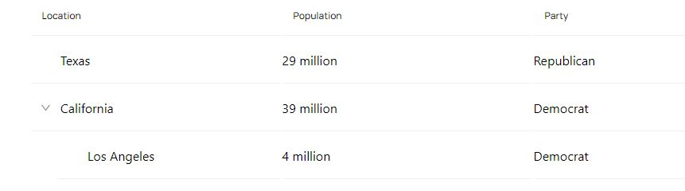

# react-exp-table

[](https://npmjs.org/package/react-exp-table)

A react table component with expandable rows. This table uses consistent columns across all child rows and does not nest tables within rows.

## Features

---

- Nested expandable rows
- Child row key mapping
- Conditional initial expand/collapse state by row
- Conditional row background colors
- Columns can include multiple entries per column
- All rows are loaded on initial load to ensure high performance when expanding/collapsing rows

## Installation

---

```
npm i react-exp-table
```

## Example

---

[https://main.d1ckh0bbpylcrw.amplifyapp.com/](https://main.d1ckh0bbpylcrw.amplifyapp.com/)

## Usage

---

```
const columns = [
  {
    title: "Location",
    columnData: [{ key: "location" }],
  },
  {
    title: "Population",
    columnData: [{ key: "population" }],
  },
  {
    title: "Party",
    columnData: [{ key: "party" }]
  }
];

const data = [
  {
      location: "Texas",
      population: "29 million",
      party: "Republican"
  },
  {
    location: "California",
    population: "39 million",
    party: "Democrat",
    child: [
      {
        location: "Los Angeles",
        population: "4 million",
        party: "Democrat"
      }
    ]
  }
];

<ExpandableTable
    columns={columns}
    data={data}
    childDataKey={"child"}
    rowKey={"location"}
></ExpandableTable>
```

## Result

---



## Props

---

| Prop         |        Type        | Default |
| ------------ | :----------------: | ------: |
| columns      | column (see below) |         |
| data         |        [ ]         |         |
| childDataKey |       string       |         |
| rowKey       |       string       |         |

## Column definition

---

```
interface Column {
  title: string;
  columnData: ColumnData[];
}

interface ColumnData {
  key: string;
  class?: string; //optional
}
```

## Authors

---

- [Chris Lapidas](https://github.com/chrislapidas) - _Development_

## License

---

This project is licensed under the MIT License - see the [LICENSE](https://github.com/chrislapidas/react-expandable-rows/blob/main/LICENSE) file for details
